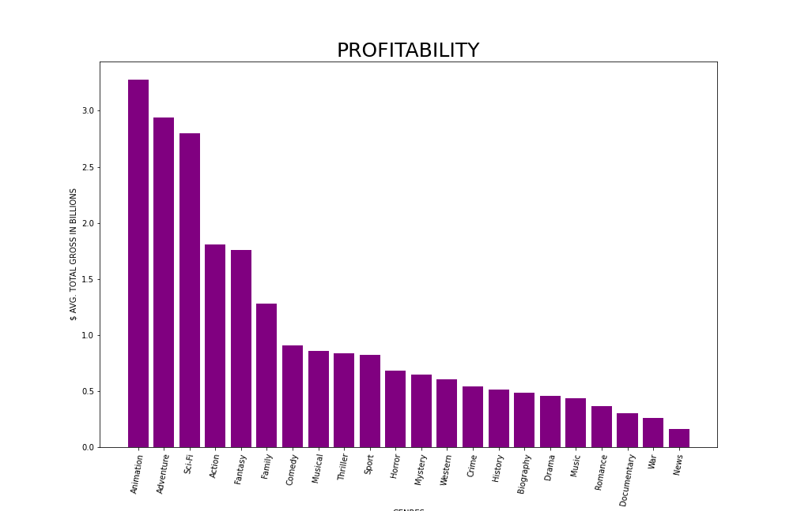
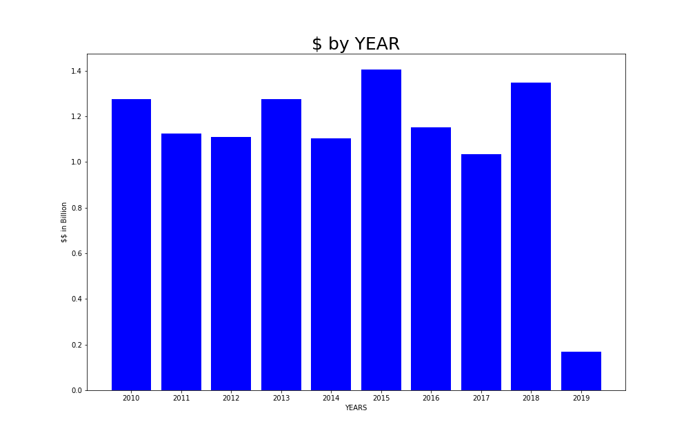
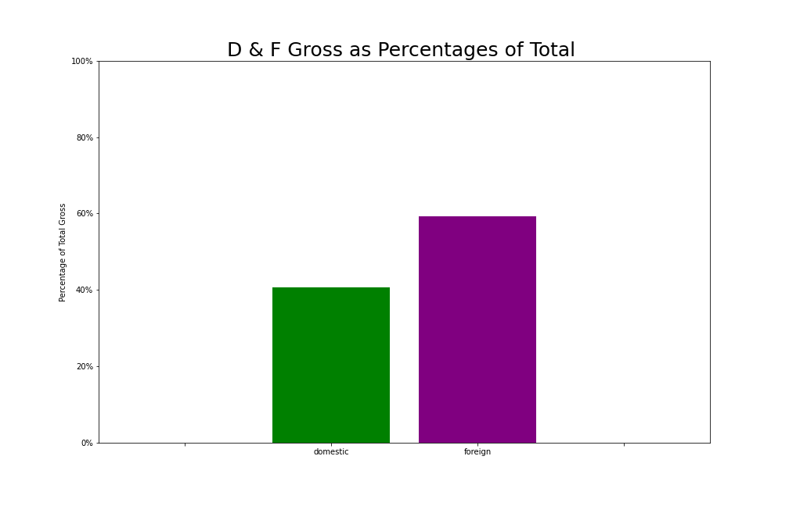

# Movie Data Analysis

   Author: Gamze Turan 
   
## Overview

This project analysis is determining profitability of a film studio is crucially dependent on picking the right film projects. In order to find the best film project we will find the most popular genres according to our datasets and their profits. Also, another aspect of film projects is their ratings. Depending on the case, rating can lower the sales of the movie or totally cross out the movie from existence (Scoot Bowles).

## Business Problem

Microsoft sees all the big companies creating original video content and they want to get in on the fun.Microsoft's new movie studio can be used to help decide what type of films to create.

## Data

The movie business has a large scale of data since they have been an existence for over a century. From selected data files, we will combine them to determine genres, ratings and profitability.

## Result
The relationship between rating and genres in the selected dataset shows that the most rating genres are News,Documentry and Biography.

In the dataset domestic and foreign gross sum is globally emphasized that top sales on the genres are Animation, Adventure and Sci-fi.Thus, people most likely prefer to watch these types of films.

According to the dataset people have watched the most movies in 2018.This graph shows the most profitable movies through out the years.

Comparing the domestic and foreign gross over total gross, percentages shows that publishing the movie worldwide increase the profit 20% more then domestic gross.

Overall the dataset shows us the year including 2016 to 2019, the movie business' foreign gross is decreasing ahead of domestic gross.

## Conclusions

Determining the data gives us info about the ratings on the genres which aren't a criteria for the profit of the genres. While top profitibality genres are the Animation, Adventure and Sci-fi, the recomendation is to start a movie business on these genres.Also, the difference between the domestic and foreign gross shows that publising movie nationwide increase the profit 20%.In this case, movie should publish worldwide.Besides, the information of the year shows us after 2016 the movies attention by the consumer decreases.So, company shoudnt publish the movie untill the market attention increases.

## For More Information
See the full analysis in the Jupyter Notebook or review this presentation.

For additional info, contact Gamze Turan at ginaturan15@gmail.com

## Repository Structure

├── data

├── images

├── README.md

├── Movie_Data_Analysis_Presentation.pdf

└── Movie_Data_Analysis.ipynb